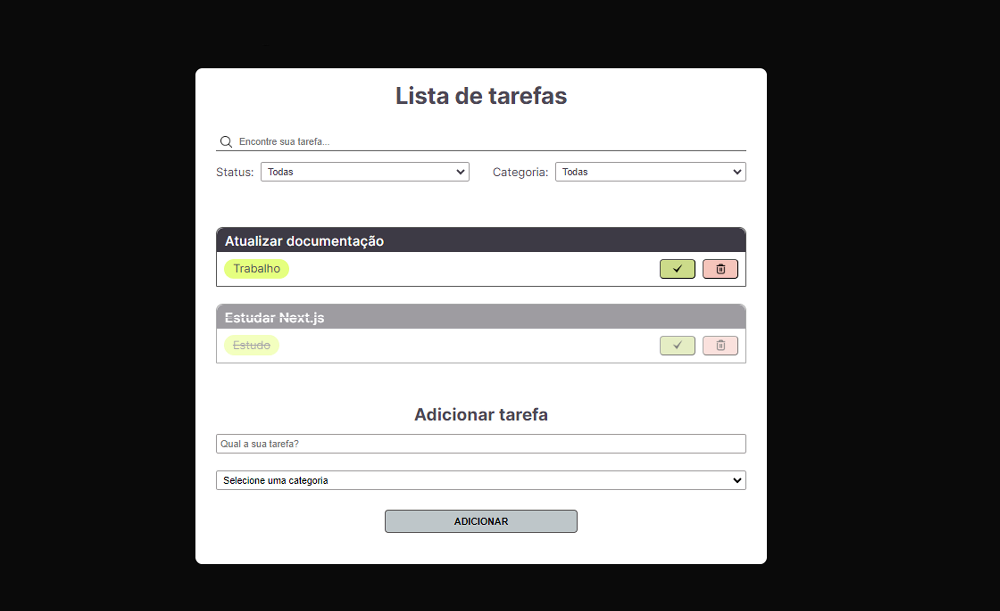

<h1 align="center"> ToDo List </h1>
<h3 align="center"> Desenvolvido com <b>React.js</b> </h3>

&nbsp;&nbsp;&nbsp;|&nbsp;&nbsp;&nbsp; <a href="#sobre">Sobre</a> &nbsp;&nbsp;&nbsp;|&nbsp;&nbsp;&nbsp;
<a href="#tecnologias-utilizadas">Tecnologias Utilizadas</a> &nbsp;&nbsp;&nbsp;|&nbsp;&nbsp;&nbsp;
 

 

  

<h4 align="center"> 
	 Status: implementando responsividade
</h4>

## Sobre
 

Projeto desenvolvido com React.js com o objetivo de treinar o desenvolvimento web.  
Trata-se de uma página de lista de tarefas, onde é possível adicionar novas tarefas, marca-las como concluídas e deleta-las da lista.
Conta também com um campo de busca e dois filtros, um filtra o status da tarefa e o outro a categoria.

---

## Tecnologias Utilizadas
 

-  REACT.JS

-  GIT

-  GitHub
  
---

## Projeto desenvolvido por:

<a href="https://www.linkedin.com/in/rayane-magdalena-473b83163/">
 
  
 <b>Rayane Magdalena</b></a> 
  

  

---			

  

